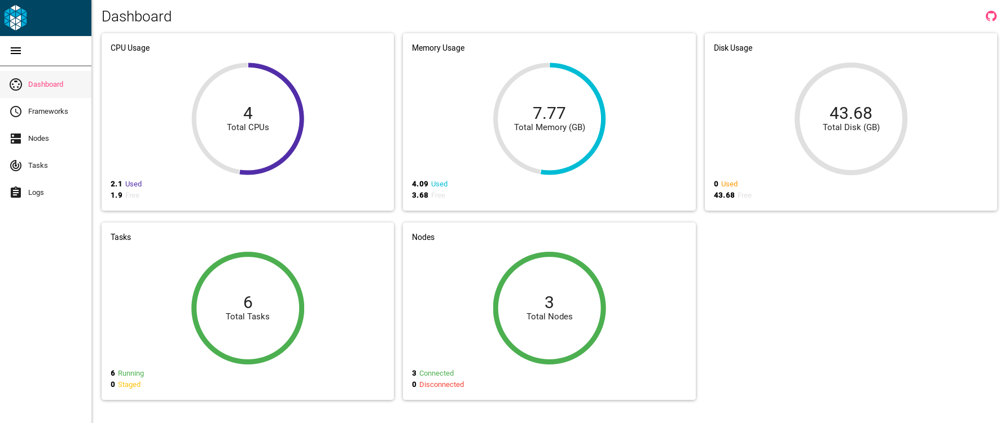
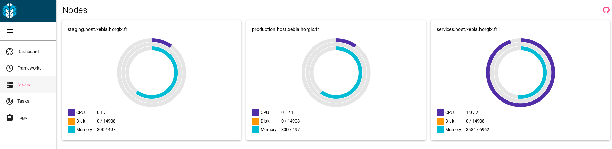
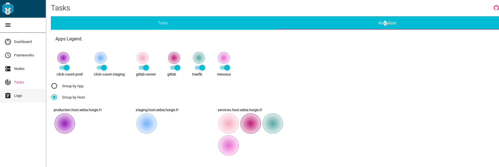
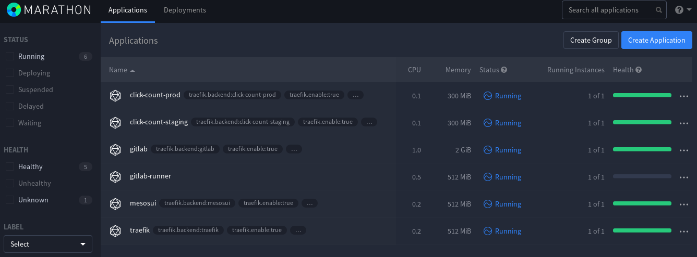

If you want to see the result running, it's possible, but will probably not be
here forever since it's running on AWS with my own money.

# Services

- [Marathon](http://deploy.coffee:8080); credentials: xebia/verysecure
- [GitLab](https://gitlab.deploy.coffee); credentials: xebia/verysecure
- [Traefik](https://traefik.deploy.coffee)
- [Mesos UI](https://cluster.deploy.coffee)
- [Count-Click CI Pipeline](https://gitlab.deploy.coffee/xebiafr/click-count/pipelines)
- [This documentation](https://clickcount.horgix.fr)

# Example run

```none
$ time make

ansible-playbook playbooks/deploy.yml -t deploy
statically included: /home/horgix/work/xebia/ansible/roles/deploy/tasks/secgroup.yml
statically included: /home/horgix/work/xebia/ansible/roles/deploy/tasks/ec2.yml

PLAY [Base setup] **************************************************************

TASK [deploy : EC2 - Create security group] ************************************
changed: [localhost]

TASK [deploy : EC2 - Create instances] *****************************************
changed: [localhost] => (item={u'type': u'm4.large', u'tags': {u'zkid': 1, u'type': u'svc', u'Name': u'services'}})
changed: [localhost] => (item={u'type': u't2.micro', u'tags': {u'zkid': 2, u'type': u'staging', u'Name': u'staging'}})
changed: [localhost] => (item={u'type': u't2.micro', u'tags': {u'zkid': 3, u'type': u'prod', u'Name': u'production'}})

TASK [deploy : Wait for SSH to come up] ****************************************
ok: [localhost] => (item={'_ansible_parsed': True, u'changed': True, '_ansible_no_log': False, u'instances': [{u'kernel': None, u'root_device_type': u'ebs', u'private_dns_name': u'ip-172-31-4-225.eu-west-1.compute.internal', u'public_ip': u'52.209.138.214', u'private_ip': u'172.31.4.225', u'id': u'i-5446a165', u'ebs_optimized': False, u'state': u'running', u'virtualization_type': u'hvm', u'architecture': u'x86_64', u'ramdisk': None, u'block_device_mapping': {u'/dev/xvda': {u'status': u'attached', u'delete_on_termination': False, u'volume_id': u'vol-e439d466'}}, u'key_name': u'aws', u'image_id': u'ami-f9dd458a', u'tenancy': u'default', u'groups': {u'sg-5b717d3c': u'Click-Count'}, u'public_dns_name': u'ec2-52-209-138-214.eu-west-1.compute.amazonaws.com', u'state_code': 16, u'tags': {u'zkid': u'1', u'type': u'svc', u'Name': u'services'}, u'placement': u'eu-west-1a', u'ami_launch_index': u'0', u'dns_name': u'ec2-52-209-138-214.eu-west-1.compute.amazonaws.com', u'region': u'eu-west-1', u'launch_time': u'2016-09-06T19:57:36.000Z', u'instance_type': u'm4.large', u'root_device_name': u'/dev/xvda', u'hypervisor': u'xen'}], '_ansible_item_result': True, u'instance_ids': [u'i-5446a165'], 'item': {u'type': u'm4.large', u'tags': {u'zkid': 1, u'type': u'svc', u'Name': u'services'}}, u'tagged_instances': [{u'kernel': None, u'root_device_type': u'ebs', u'private_dns_name': u'ip-172-31-4-225.eu-west-1.compute.internal', u'public_ip': u'52.209.138.214', u'private_ip': u'172.31.4.225', u'id': u'i-5446a165', u'ebs_optimized': False, u'state': u'running', u'virtualization_type': u'hvm', u'architecture': u'x86_64', u'ramdisk': None, u'block_device_mapping': {u'/dev/xvda': {u'status': u'attached', u'delete_on_termination': False, u'volume_id': u'vol-e439d466'}}, u'key_name': u'aws', u'image_id': u'ami-f9dd458a', u'tenancy': u'default', u'groups': {u'sg-5b717d3c': u'Click-Count'}, u'public_dns_name': u'ec2-52-209-138-214.eu-west-1.compute.amazonaws.com', u'state_code': 16, u'tags': {u'zkid': u'1', u'type': u'svc', u'Name': u'services'}, u'placement': u'eu-west-1a', u'ami_launch_index': u'0', u'dns_name': u'ec2-52-209-138-214.eu-west-1.compute.amazonaws.com', u'region': u'eu-west-1', u'launch_time': u'2016-09-06T19:57:36.000Z', u'instance_type': u'm4.large', u'root_device_name': u'/dev/xvda', u'hypervisor': u'xen'}], 'invocation': {'module_name': u'ec2', u'module_args': {u'kernel': None, u'image': u'ami-f9dd458a', u'monitoring': False, u'user_data': None, u'termination_protection': False, u'private_ip': None, u'spot_type': u'one-time', u'ec2_url': None, u'id': None, u'source_dest_check': True, u'aws_secret_key': None, u'spot_wait_timeout': u'600', u'spot_price': None, u'zone': None, u'exact_count': 1, u'ebs_optimized': False, u'state': u'present', u'placement_group': None, u'count_tag': u"{'type': 'svc'}", u'ramdisk': None, u'key_name': u'aws', u'spot_launch_group': None, u'vpc_subnet_id': u'subnet-3adebc5e', u'instance_ids': None, u'tenancy': u'default', u'profile': None, u'assign_public_ip': True, u'group': [u'Click-Count'], u'wait': True, u'count': 1, u'aws_access_key': None, u'security_token': None, u'instance_profile_name': None, u'region': u'eu-west-1', u'network_interfaces': None, u'instance_initiated_shutdown_behavior': u'stop', u'instance_type': u'm4.large', u'wait_timeout': u'300', u'volumes': [{u'volume_size': 20, u'volume_type': u'gp2', u'device_name': u'/dev/xvda'}], u'instance_tags': {u'zkid': 1, u'type': u'svc', u'Name': u'services'}, u'group_id': None, u'validate_certs': True}}})
ok: [localhost] => (item={'_ansible_parsed': True, u'changed': True, '_ansible_no_log': False, u'instances': [{u'kernel': None, u'root_device_type': u'ebs', u'private_dns_name': u'ip-172-31-5-225.eu-west-1.compute.internal', u'public_ip': u'52.210.28.188', u'private_ip': u'172.31.5.225', u'id': u'i-5e45a26f', u'ebs_optimized': False, u'state': u'running', u'virtualization_type': u'hvm', u'architecture': u'x86_64', u'ramdisk': None, u'block_device_mapping': {u'/dev/xvda': {u'status': u'attached', u'delete_on_termination': False, u'volume_id': u'vol-1e39d49c'}}, u'key_name': u'aws', u'image_id': u'ami-f9dd458a', u'tenancy': u'default', u'groups': {u'sg-5b717d3c': u'Click-Count'}, u'public_dns_name': u'ec2-52-210-28-188.eu-west-1.compute.amazonaws.com', u'state_code': 16, u'tags': {u'zkid': u'2', u'type': u'staging', u'Name': u'staging'}, u'placement': u'eu-west-1a', u'ami_launch_index': u'0', u'dns_name': u'ec2-52-210-28-188.eu-west-1.compute.amazonaws.com', u'region': u'eu-west-1', u'launch_time': u'2016-09-06T19:57:57.000Z', u'instance_type': u't2.micro', u'root_device_name': u'/dev/xvda', u'hypervisor': u'xen'}], '_ansible_item_result': True, u'instance_ids': [u'i-5e45a26f'], 'item': {u'type': u't2.micro', u'tags': {u'zkid': 2, u'type': u'staging', u'Name': u'staging'}}, u'tagged_instances': [{u'kernel': None, u'root_device_type': u'ebs', u'private_dns_name': u'ip-172-31-5-225.eu-west-1.compute.internal', u'public_ip': u'52.210.28.188', u'private_ip': u'172.31.5.225', u'id': u'i-5e45a26f', u'ebs_optimized': False, u'state': u'running', u'virtualization_type': u'hvm', u'architecture': u'x86_64', u'ramdisk': None, u'block_device_mapping': {u'/dev/xvda': {u'status': u'attached', u'delete_on_termination': False, u'volume_id': u'vol-1e39d49c'}}, u'key_name': u'aws', u'image_id': u'ami-f9dd458a', u'tenancy': u'default', u'groups': {u'sg-5b717d3c': u'Click-Count'}, u'public_dns_name': u'ec2-52-210-28-188.eu-west-1.compute.amazonaws.com', u'state_code': 16, u'tags': {u'zkid': u'2', u'type': u'staging', u'Name': u'staging'}, u'placement': u'eu-west-1a', u'ami_launch_index': u'0', u'dns_name': u'ec2-52-210-28-188.eu-west-1.compute.amazonaws.com', u'region': u'eu-west-1', u'launch_time': u'2016-09-06T19:57:57.000Z', u'instance_type': u't2.micro', u'root_device_name': u'/dev/xvda', u'hypervisor': u'xen'}], 'invocation': {'module_name': u'ec2', u'module_args': {u'kernel': None, u'image': u'ami-f9dd458a', u'monitoring': False, u'user_data': None, u'termination_protection': False, u'private_ip': None, u'spot_type': u'one-time', u'ec2_url': None, u'id': None, u'source_dest_check': True, u'aws_secret_key': None, u'spot_wait_timeout': u'600', u'spot_price': None, u'zone': None, u'exact_count': 1, u'ebs_optimized': False, u'state': u'present', u'placement_group': None, u'count_tag': u"{'type': 'staging'}", u'ramdisk': None, u'key_name': u'aws', u'spot_launch_group': None, u'vpc_subnet_id': u'subnet-3adebc5e', u'instance_ids': None, u'tenancy': u'default', u'profile': None, u'assign_public_ip': True, u'group': [u'Click-Count'], u'wait': True, u'count': 1, u'aws_access_key': None, u'security_token': None, u'instance_profile_name': None, u'region': u'eu-west-1', u'network_interfaces': None, u'instance_initiated_shutdown_behavior': u'stop', u'instance_type': u't2.micro', u'wait_timeout': u'300', u'volumes': [{u'volume_size': 20, u'volume_type': u'gp2', u'device_name': u'/dev/xvda'}], u'instance_tags': {u'zkid': 2, u'type': u'staging', u'Name': u'staging'}, u'group_id': None, u'validate_certs': True}}})
ok: [localhost] => (item={'_ansible_parsed': True, u'changed': True, '_ansible_no_log': False, u'instances': [{u'kernel': None, u'root_device_type': u'ebs', u'private_dns_name': u'ip-172-31-4-36.eu-west-1.compute.internal', u'public_ip': u'52.210.134.157', u'private_ip': u'172.31.4.36', u'id': u'i-1d44a32c', u'ebs_optimized': False, u'state': u'running', u'virtualization_type': u'hvm', u'architecture': u'x86_64', u'ramdisk': None, u'block_device_mapping': {u'/dev/xvda': {u'status': u'attached', u'delete_on_termination': False, u'volume_id': u'vol-e839d46a'}}, u'key_name': u'aws', u'image_id': u'ami-f9dd458a', u'tenancy': u'default', u'groups': {u'sg-5b717d3c': u'Click-Count'}, u'public_dns_name': u'ec2-52-210-134-157.eu-west-1.compute.amazonaws.com', u'state_code': 16, u'tags': {u'zkid': u'3', u'type': u'prod', u'Name': u'production'}, u'placement': u'eu-west-1a', u'ami_launch_index': u'0', u'dns_name': u'ec2-52-210-134-157.eu-west-1.compute.amazonaws.com', u'region': u'eu-west-1', u'launch_time': u'2016-09-06T19:58:19.000Z', u'instance_type': u't2.micro', u'root_device_name': u'/dev/xvda', u'hypervisor': u'xen'}], '_ansible_item_result': True, u'instance_ids': [u'i-1d44a32c'], 'item': {u'type': u't2.micro', u'tags': {u'zkid': 3, u'type': u'prod', u'Name': u'production'}}, u'tagged_instances': [{u'kernel': None, u'root_device_type': u'ebs', u'private_dns_name': u'ip-172-31-4-36.eu-west-1.compute.internal', u'public_ip': u'52.210.134.157', u'private_ip': u'172.31.4.36', u'id': u'i-1d44a32c', u'ebs_optimized': False, u'state': u'running', u'virtualization_type': u'hvm', u'architecture': u'x86_64', u'ramdisk': None, u'block_device_mapping': {u'/dev/xvda': {u'status': u'attached', u'delete_on_termination': False, u'volume_id': u'vol-e839d46a'}}, u'key_name': u'aws', u'image_id': u'ami-f9dd458a', u'tenancy': u'default', u'groups': {u'sg-5b717d3c': u'Click-Count'}, u'public_dns_name': u'ec2-52-210-134-157.eu-west-1.compute.amazonaws.com', u'state_code': 16, u'tags': {u'zkid': u'3', u'type': u'prod', u'Name': u'production'}, u'placement': u'eu-west-1a', u'ami_launch_index': u'0', u'dns_name': u'ec2-52-210-134-157.eu-west-1.compute.amazonaws.com', u'region': u'eu-west-1', u'launch_time': u'2016-09-06T19:58:19.000Z', u'instance_type': u't2.micro', u'root_device_name': u'/dev/xvda', u'hypervisor': u'xen'}], 'invocation': {'module_name': u'ec2', u'module_args': {u'kernel': None, u'image': u'ami-f9dd458a', u'monitoring': False, u'user_data': None, u'termination_protection': False, u'private_ip': None, u'spot_type': u'one-time', u'ec2_url': None, u'id': None, u'source_dest_check': True, u'aws_secret_key': None, u'spot_wait_timeout': u'600', u'spot_price': None, u'zone': None, u'exact_count': 1, u'ebs_optimized': False, u'state': u'present', u'placement_group': None, u'count_tag': u"{'type': 'prod'}", u'ramdisk': None, u'key_name': u'aws', u'spot_launch_group': None, u'vpc_subnet_id': u'subnet-3adebc5e', u'instance_ids': None, u'tenancy': u'default', u'profile': None, u'assign_public_ip': True, u'group': [u'Click-Count'], u'wait': True, u'count': 1, u'aws_access_key': None, u'security_token': None, u'instance_profile_name': None, u'region': u'eu-west-1', u'network_interfaces': None, u'instance_initiated_shutdown_behavior': u'stop', u'instance_type': u't2.micro', u'wait_timeout': u'300', u'volumes': [{u'volume_size': 20, u'volume_type': u'gp2', u'device_name': u'/dev/xvda'}], u'instance_tags': {u'zkid': 3, u'type': u'prod', u'Name': u'production'}, u'group_id': None, u'validate_certs': True}}})

PLAY [Route 53] ****************************************************************

PLAY RECAP *********************************************************************
localhost                  : ok=3    changed=2    unreachable=0    failed=0

./inventory/ec2.py --refresh-cache > /dev/null
ansible-playbook playbooks/deploy.yml -t route53
statically included: /home/horgix/work/xebia/ansible/roles/deploy/tasks/secgroup.yml
statically included: /home/horgix/work/xebia/ansible/roles/deploy/tasks/ec2.yml

PLAY [Base setup] **************************************************************

PLAY [Route 53] ****************************************************************

TASK [route53 : Add Route 53 host records] *************************************
changed: [production -> 127.0.0.1]
changed: [services -> 127.0.0.1]
changed: [staging -> 127.0.0.1]

TASK [route53 : Add Route 53 main record] **************************************
skipping: [production]
skipping: [staging]
changed: [services -> 127.0.0.1]

TASK [route53 : Add Route 53 services records] *********************************
skipping: [production]
skipping: [staging]
ok: [services -> 127.0.0.1]

PLAY RECAP *********************************************************************
production                 : ok=1    changed=1    unreachable=0    failed=0
services                   : ok=3    changed=2    unreachable=0    failed=0
staging                    : ok=1    changed=1    unreachable=0    failed=0

ansible-playbook playbooks/master.yml -b -t base
statically included: /home/horgix/work/xebia/ansible/roles/base/tasks/requirements.yml
statically included: /home/horgix/work/xebia/ansible/roles/base/tasks/zookeeper.yml
statically included: /home/horgix/work/xebia/ansible/roles/base/tasks/mesos.yml
statically included: /home/horgix/work/xebia/ansible/roles/base/tasks/marathon.yml
statically included: /home/horgix/work/xebia/ansible/roles/services/tasks/mesos-ui.yml
statically included: /home/horgix/work/xebia/ansible/roles/services/tasks/traefik.yml
statically included: /home/horgix/work/xebia/ansible/roles/services/tasks/gitlab.yml
statically included: /home/horgix/work/xebia/ansible/roles/services/tasks/gitlab-content.yml
statically included: /home/horgix/work/xebia/ansible/roles/services/tasks/gitlab-runner.yml

PLAY [Base setup] **************************************************************

TASK [setup] *******************************************************************
ok: [staging]
ok: [production]
ok: [services]

TASK [base : Set Zookeeper Nodes fact] *****************************************
ok: [staging]
ok: [production]
ok: [services]

TASK [base : Zookeeper nodes] **************************************************
ok: [production] => {
    "msg": "3:172.31.4.36,2:172.31.5.225,1:172.31.4.225"
}
ok: [staging] => {
    "msg": "3:172.31.4.36,2:172.31.5.225,1:172.31.4.225"
}
ok: [services] => {
    "msg": "3:172.31.4.36,2:172.31.5.225,1:172.31.4.225"
}

TASK [base : Upgrade every package] ********************************************
changed: [staging]
changed: [services]
changed: [production]

TASK [base : Docker - Install package] *****************************************
changed: [services]
changed: [staging]
changed: [production]

TASK [base : Docker - Install python lib] **************************************
changed: [staging]
changed: [production]
changed: [services]

TASK [base : Docker - start and enable service] ********************************
changed: [staging]
changed: [production]
changed: [services]

TASK [base : Docker - Pull base images] ****************************************
changed: [services] => (item=horgix/zookeeper)
changed: [staging] => (item=horgix/zookeeper)
changed: [production] => (item=horgix/zookeeper)
changed: [services] => (item=horgix/mesos-slave)
changed: [production] => (item=horgix/mesos-slave)
changed: [staging] => (item=horgix/mesos-slave)
changed: [services] => (item=mesoscloud/mesos-master)
changed: [production] => (item=mesoscloud/mesos-master)
changed: [staging] => (item=mesoscloud/mesos-master)
changed: [services] => (item=mesoscloud/marathon)
changed: [production] => (item=mesoscloud/marathon)
changed: [staging] => (item=mesoscloud/marathon)

TASK [base : Zookeeper - Start] ************************************************
changed: [services]
changed: [production]
changed: [staging]

TASK [base : Mesos - Start slave] **********************************************
changed: [production]
changed: [services]
changed: [staging]

TASK [base : Mesos - Start master] *********************************************
changed: [staging]
changed: [services]
changed: [production]

TASK [base : Marathon - Start] *************************************************
changed: [staging]
changed: [services]
changed: [production]

PLAY [Setup Services] **********************************************************

TASK [setup] *******************************************************************
ok: [services]

PLAY RECAP *********************************************************************
production                 : ok=12   changed=9    unreachable=0    failed=0
services                   : ok=13   changed=9    unreachable=0    failed=0
staging                    : ok=12   changed=9    unreachable=0    failed=0

ansible-playbook playbooks/master.yml -b -t services
statically included: /home/horgix/work/xebia/ansible/roles/base/tasks/requirements.yml
statically included: /home/horgix/work/xebia/ansible/roles/base/tasks/zookeeper.yml
statically included: /home/horgix/work/xebia/ansible/roles/base/tasks/mesos.yml
statically included: /home/horgix/work/xebia/ansible/roles/base/tasks/marathon.yml
statically included: /home/horgix/work/xebia/ansible/roles/services/tasks/mesos-ui.yml
statically included: /home/horgix/work/xebia/ansible/roles/services/tasks/traefik.yml
statically included: /home/horgix/work/xebia/ansible/roles/services/tasks/gitlab.yml
statically included: /home/horgix/work/xebia/ansible/roles/services/tasks/gitlab-content.yml
statically included: /home/horgix/work/xebia/ansible/roles/services/tasks/gitlab-runner.yml

PLAY [Base setup] **************************************************************

TASK [setup] *******************************************************************
ok: [staging]
ok: [production]
ok: [services]

TASK [base : Set Zookeeper Nodes fact] *****************************************
ok: [production]
ok: [services]
ok: [staging]

TASK [base : Zookeeper nodes] **************************************************
ok: [production] => {
    "msg": "3:172.31.4.36,2:172.31.5.225,1:172.31.4.225"
}
ok: [services] => {
    "msg": "3:172.31.4.36,2:172.31.5.225,1:172.31.4.225"
}
ok: [staging] => {
    "msg": "3:172.31.4.36,2:172.31.5.225,1:172.31.4.225"
}

PLAY [Setup Services] **********************************************************

TASK [setup] *******************************************************************
ok: [services]

TASK [services : Docker - Pull service images] *********************************
changed: [services] => (item=gitlab/gitlab-ce)
changed: [services] => (item=horgix/gitlab-runner)
changed: [services] => (item=traefik)
changed: [services] => (item=jetty)
changed: [services] => (item=maven)

TASK [services : MesosUI - Generate Marathon JSON description] *****************
changed: [services -> localhost]

TASK [services : MesosUI - Run Marathon app] ***********************************
ok: [services]

TASK [services : Create volumes directories] ***********************************
changed: [services]

TASK [services : Make sure acme.json exists] ***********************************
ok: [services]

TASK [services : Configure] ****************************************************
changed: [services]

TASK [services : Generate Marathon JSON description] ***************************
changed: [services -> localhost]

TASK [services : Run Marathon app] *********************************************
ok: [services]

TASK [services : Create volumes directories] ***********************************
changed: [services] => (item=/srv/gitlab)
changed: [services] => (item=/srv/gitlab/config)
changed: [services] => (item=/srv/gitlab/logs)
changed: [services] => (item=/srv/gitlab/data)
changed: [services] => (item=/srv/gitlab/logs/reconfigure)

TASK [services : Generate Marathon JSON description] ***************************
changed: [services -> localhost]

TASK [services : Run Marathon app] *********************************************
ok: [services]

TASK [services : Wait for GitLab to come up] ***********************************
FAILED - RETRYING: TASK: services : Wait for GitLab to come up (20 retries left).
FAILED - RETRYING: TASK: services : Wait for GitLab to come up (19 retries left).
FAILED - RETRYING: TASK: services : Wait for GitLab to come up (18 retries left).
FAILED - RETRYING: TASK: services : Wait for GitLab to come up (17 retries left).
FAILED - RETRYING: TASK: services : Wait for GitLab to come up (16 retries left).
FAILED - RETRYING: TASK: services : Wait for GitLab to come up (15 retries left).
ok: [services]
 [WARNING]: Consider using get_url or uri module rather than running curl


TASK [services : Get GitLab private token] *************************************
ok: [services]

TASK [services : Set GitLab private token as fact] *****************************
ok: [services]

TASK [services : Create Gitlab Group] ******************************************
changed: [services -> 127.0.0.1]

TASK [services : Create Gitlab User] *******************************************
changed: [services -> 127.0.0.1]

TASK [services : Create Gitlab Project] ****************************************
changed: [services -> 127.0.0.1]

TASK [services : Set variables] ************************************************
ok: [services] => (item=key=HUB_LOGIN&value=<stripped>)
ok: [services] => (item=key=HUB_PASSWORD&value=<stripped>)
ok: [services] => (item=key=MARATHON_URL&value=http://xebia.horgix.fr:8080)
ok: [services] => (item=key=MARATHON_USERNAME&value=<stripped>)
ok: [services] => (item=key=MARATHON_PASSWORD&value=<stripped>)
ok: [services] => (item=key=STAGING_ENDPOINT&value=staging.xebia.horgix.fr)
ok: [services] => (item=key=PRODUCTION_ENDPOINT&value=prod.xebia.horgix.fr)
ok: [services] => (item=key=STAGING_REDIS&value=<stripped>)
ok: [services] => (item=key=PRODUCTION_REDIS&value=<stripped>)

TASK [services : GitLab Runner - Get runners token] ****************************
ok: [services]

TASK [services : GitLab Runner - Set runners token as fact] ********************
ok: [services]

TASK [services : GitLab Runner - Generate Marathon JSON description] ***********
changed: [services -> localhost]

TASK [services : Runner - Run Marathon app] ************************************
ok: [services]

PLAY RECAP *********************************************************************
production                 : ok=3    changed=0    unreachable=0    failed=0
services                   : ok=26   changed=11   unreachable=0    failed=0
staging                    : ok=3    changed=0    unreachable=0    failed=0

make  51.26s user 8.01s system 8% cpu 12:03.27 total
```

# Screenshots

## Mesos Dashboard



## Mesos Nodes



## Mesos Tasks



## Marathon



## Traefik


