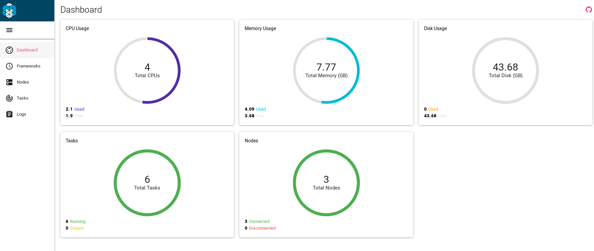
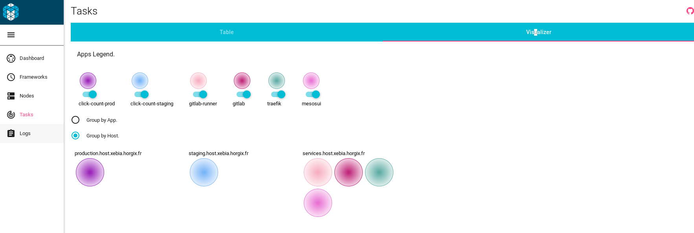

**If you want to directly jump to the "do it" part of this documentation, head
over to the ["How To" page](howto.md).**

# This project

This project aims at building to the CI/CD infrastructure for the [Click-Count
application](TODO), as asked by the following statement:

> Le livrable attendu doit être un repository sur GitHub contenant la
> **description de l’infrastructure** et du pipeline de livraison continu
> entièrement automatisés afin que la solution puisse être déployée sur un
> environnement différent.

This repository will allow you to spawn the so-said infrastucture, with the
following properties:

- Deployed with Ansible
- Based on AWS EC2
- Running **entirely** on Docker
- Using Zookeeper and Mesos for resources management
- Using Marathon to deploy and orchestrate services and the application itself

The EC2 part can of course be replaced by any other IAAS provider, may it be
public or private.

# Requirements

## On your machine

The following software/modules are required to be able to use this repo:

- Ansible (2.2, latest)
- Python 2.7 (Ansible sadly doesn't work with Python 3)
- pyapi-gitlab (python module for GitLab API)
- boto (python module for AWS API)
- the private ssh key with the privilege described in the "AWS side" part

## AWS side

Theses parts are also required on AWS side :

- An AWS user with the following policies:
    - AdministratorAccess
    - AmazonEC2FullAccess
    - AmazonRoute53FullAccess
- A DNS Zone managed by Route 53

# What you end up with

## The cluster itself

- 3 nodes cluster on AWS:
    - One "services" node (m4.large)
    - One "staging" node (t2.micro)
    - One "production" node (t2.micro)
- Each one of them runs:
    - Zookeeper
    - Mesos Slave
    - Mesos Master
    - Marathon
- The "services" node also runs the following services as marathon apps:
    - [GitLab](https://about.gitlab.com/)
    - a [GitLab CI runner](https://gitlab.com/gitlab-org/gitlab-ci-multi-runner)
    - [Traefik](http://traefik.io/)
    - a pretty [alternative Mesos UI](https://github.com/Capgemini/mesos-ui/)
- The application [click-count](TODO) is deployed, depending on the targeted
  environment, on the staging and production nodes

# Demo

- [GitLab](http://gitlab.xebia.horgix.fr)
- [Traefik](http://traefik.xebia.horgix.fr)
- [Mesos UI](http://cluster.xebia.horgix.fr)
- [This documentation](http://doc.xebia.horgix.fr)

## Screenshots

### Mesos Dashboard

### Mesos Nodes

### Mesos Tasks

